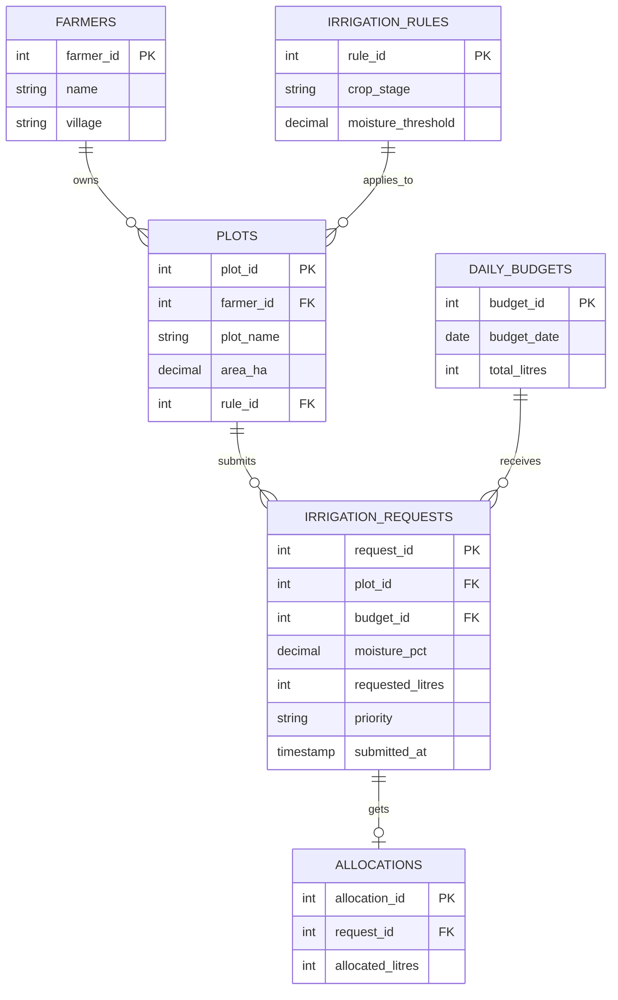

# Database explanation

## The idea

A cooperative has limited water each day. Farmers submit irrigation requests for their sugarcane plots. The database gives drier plots a higher priority and distributes the day's supply without allocating more than is available.

## ER diagram



## Why separate these tables?

- A farmer can own several plots, so farmer details belong in one table.
- Multiple plots share a crop-stage rule, so thresholds are stored once.
- Multiple requests share one daily budget, so the supply is not repeated in every request.
- A request can exist without an allocation. An allocation's unique `request_id` allows at most one allocation row per request.
- Remaining water is calculated from the budget minus the sum of allocations. It is not another stored balance.

This avoids repeating names, thresholds and daily supply values. The stored priority is the classification made when a request was submitted; current rule edits do not automatically recalculate it. This version has no rule-editing interface or version history.

## Priority trigger

When a request is inserted, PostgreSQL looks up its plot's moisture threshold.

```text
Moisture < threshold - 10  → High
Moisture < threshold       → Medium
Otherwise                  → Low
```

For a threshold of 45%, moisture of 20% gives High, 40% gives Medium, and 50% gives Low. These are classroom examples, not agricultural recommendations.

The API does not send a priority. The `BEFORE INSERT` trigger fills it in.

## Allocation function

`SELECT allocate_water(CURRENT_DATE);`

1. Read and lock that day's budget with `FOR UPDATE`.
2. Subtract existing allocations to find the remaining supply.
3. Visit High requests first, then Medium, then Low. Within each group, use submission order.
4. Give each request the smaller of its outstanding need and the remaining supply.
5. Stop when the supply is exhausted.

A second allocation call waits for the first call's budget lock. Calling the function again cannot allocate the same water twice. If a SQL error occurs, the function's changes roll back together.

The return value is the number of litres allocated by that call.

## DBMS concepts to explain

| Concept           | Example                                                              |
| ----------------- | -------------------------------------------------------------------- |
| Primary key       | `farmer_id`, `plot_id`, `request_id`                                 |
| Foreign key       | Each plot refers to an existing farmer                               |
| UNIQUE            | One budget per date; one request per plot per date                   |
| CHECK             | Positive water quantities; moisture between 0 and 100                |
| Trigger           | Automatically assign a request's priority                            |
| PL/pgSQL function | Allocate the available water                                         |
| View              | `request_summary` joins request, farmer, plot and allocation details |
| LEFT JOIN         | Include requests that have not received water yet                    |
| GROUP BY / SUM    | Total allocated water per farmer                                     |
| Transaction       | All changes in one allocation call succeed or fail together          |
| Row lock          | Two allocation calls cannot spend the same daily supply              |

## Scope

This version tracks requests and assigned water. There are no crop cycles, rule versions, JSON snapshots, audit ledgers or consumption sessions. All quantities use litres. Crop stage is selected when a plot is added. The budget cannot be changed after allocation, and only unallocated requests can be removed.

Allocation is a simple priority policy: it can leave lower-priority requests waiting. It is not AI, a fairness guarantee or an agronomic water-volume calculator.
