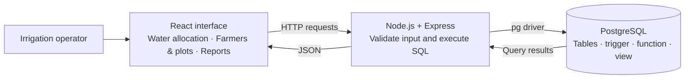
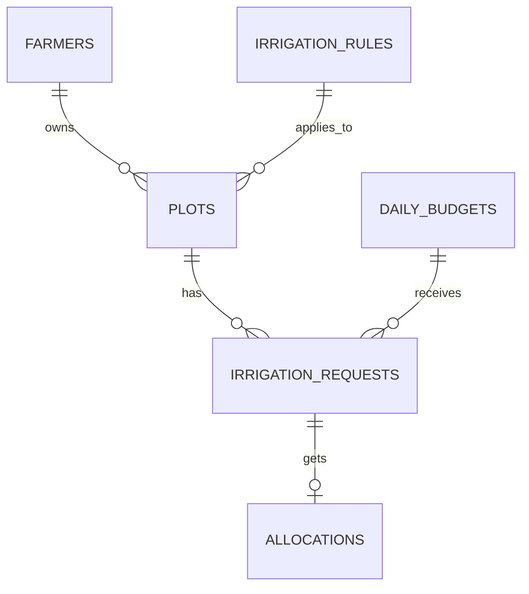
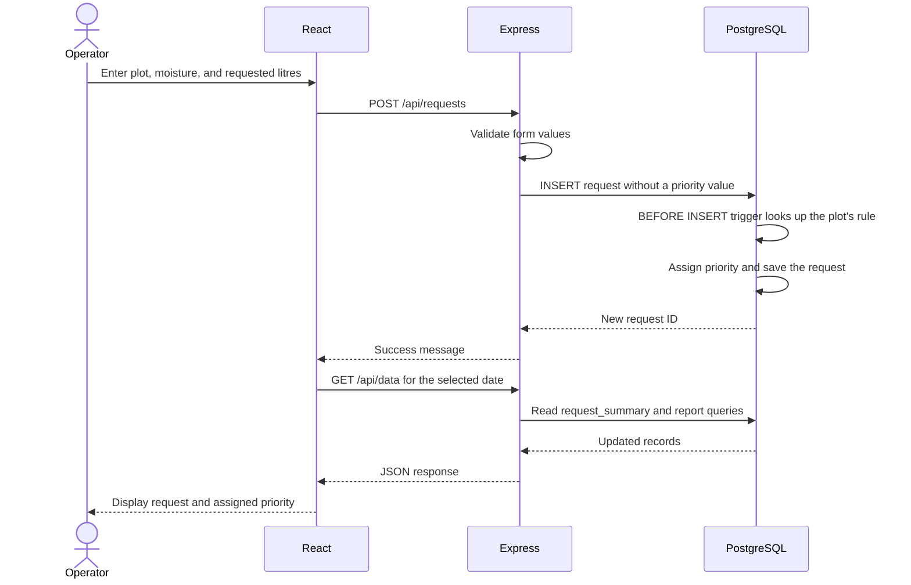

<div align="center">


# 🌱 CaneFlow

**Smart Irrigation Management System for Sugarcane Cultivation**

A DBMS mini project for managing irrigation requests and distributing a limited daily water supply.

[](https://www.postgresql.org/)
[](https://expressjs.com/)
[](https://react.dev/)
[](https://vite.dev/)

**6 tables · 1 priority trigger · 1 allocation function · 1 view · 3 screens**

</div>

## 📑 Contents

| Project | Database | Running the app |
| --- | --- | --- |
| [The problem](#-the-problem) | [Data model](#-data-model) | [Local setup](#-local-setup) |
| [Features](#-features) | [Request journey](#-request-journey) | [App tour and demo](#-app-tour-and-demo) |
| [Architecture](#-architecture) | [Priority and allocation](#-priority-and-allocation) | [Verification](#-verification) |
| [Project layout](#-project-layout) | [Transactions and integrity](#-transactions-and-integrity) | [Deployment](#-deployment) |
| [Scope](#-scope) | [DBMS concepts](#-dbms-concepts) | [Troubleshooting](#-troubleshooting) |

## 💧 The problem

An irrigation facility serves several sugarcane farmers, but its daily water supply may be smaller than the total requested. It needs to record the requests, decide their priority, and track how much water each plot receives.

**CaneFlow is designed for the irrigation facility's operator.** The operator registers farmers and plots, enters moisture readings and water requests on their behalf, and sets the day's supply. PostgreSQL assigns a priority to each request and allocates the available water when the operator clicks **Allocate water**.

| Requirement | How the project handles it |
| --- | --- |
| Keep farmer and plot records connected | Separate tables linked by foreign keys |
| Use different moisture thresholds for crop stages | An `irrigation_rules` lookup table |
| Assign priority when a request is submitted | A `BEFORE INSERT` trigger |
| Distribute water within the daily budget | A PL/pgSQL allocation function |
| Show requests that received all, some, or no water | A joined view with calculated status |
| Summarize allocations for the operator | SQL joins, `SUM`, and `GROUP BY` |

The sample dataset contains **4 farmers, 4 plots, and 4 crop-stage rules**. On its first day, **150,000 L is requested against a supply of 100,000 L**.

## ✨ Features

- **Farmer and plot registration:** store village, plot area, ownership, and crop stage.
- **Daily water budgets:** record the available supply for a selected date.
- **Irrigation requests:** enter moisture percentage and the amount of water requested.
- **Automatic priority:** PostgreSQL classifies new requests as High, Medium, or Low.
- **Water allocation:** process requests by priority and allow a partial allocation when supply runs short.
- **Reports with visible SQL:** inspect allocation totals per farmer and daily supply summaries.

## 🏗️ Architecture



| Layer | Technology | Responsibility |
| --- | --- | --- |
| Frontend | React, React Router, CSS, Lucide icons | Forms, navigation, request lists, and reports |
| Build tool | Vite | Local frontend server and production build |
| Backend | Node.js, Express, Zod | API routes and input validation |
| Database access | `pg` (node-postgres) | Parameterized SQL queries |
| Database | PostgreSQL 17, SQL, PL/pgSQL | Relationships, constraints, priority assignment, and allocation |
| Hosting | Render + Neon | Render runs React and Express; Neon hosts PostgreSQL |

The project uses JavaScript and JSX. SQL is written directly in the repository. During deployment, Express serves both the built frontend and the `/api` routes from one website.

## 🗄️ Data model

All six tables are defined in [`db/001_schema.sql`](db/001_schema.sql).



| Table | Stores | Important constraints |
| --- | --- | --- |
| `farmers` | Farmer ID, name, village | Primary key; required name and village |
| `irrigation_rules` | Crop stage and moisture threshold | Unique stage; threshold between 0 and 100 |
| `plots` | Farmer, plot name, area, crop-stage rule | Foreign keys to farmer and rule; positive area |
| `daily_budgets` | Date and available litres | One budget per date; positive supply |
| `irrigation_requests` | Plot, budget, moisture, requested litres, priority, submission time | One request per plot per budget; valid moisture, quantity, and priority |
| `allocations` | Request and allocated litres | At most one allocation row per request; positive quantity |

Farmer details are stored once and shared by their plots. Crop-stage thresholds are stored once and referenced by plots. Daily supply is stored once in its budget. Remaining water is calculated from the budget minus saved allocations.

The [`request_summary` view](db/003_views.sql) joins all six tables and calculates each request's **Waiting**, **Partial**, or **Allocated** status. Its `LEFT JOIN` keeps requests visible before they receive water.

See [`DBMS.md`](DBMS.md) for the complete ER diagram with columns and the database explanation.

## 🔄 Request journey



The trigger runs when a request is inserted through the app, the seed script, or SQL. The operator does not choose its priority.

## ⚙️ Priority and allocation

### Assigning priority

The `priority_before_insert` trigger calls `set_request_priority()` in [`db/002_functions.sql`](db/002_functions.sql). It compares the reading with the threshold for the plot's crop stage:

| Condition | Priority |
| --- | --- |
| Moisture is below `threshold - 10` | High |
| Moisture is at least `threshold - 10` but below `threshold` | Medium |
| Moisture is at least `threshold` | Low |

For **Grand growth**, the sample threshold is **45%**: a reading of **20% → High**, **40% → Medium**, and **50% → Low**. The margin of 10 means ten percentage points.

The four sample thresholds are Establishment **35%**, Tillering **40%**, Grand growth **45%**, and Maturity **30%**. These are illustrative values for the classroom demonstration.

### Allocating water

The **Allocate water** button calls `POST /api/allocate`. Express executes:

```sql
SELECT allocate_water($1); -- $1 is the selected date
```

The function:

1. Locks the selected day's budget using `FOR UPDATE`.
2. Subtracts existing allocations from the daily supply.
3. Processes High requests, then Medium, then Low. Ties use submission time, followed by request ID.
4. Gives each request the smaller of its outstanding need and the remaining supply.
5. Saves the allocation and stops when no water remains.

It returns the litres added by that call. Existing allocations count toward both the used supply and each request's fulfilled amount, so calling it again does not allocate the same water twice.

## 🔒 Transactions and integrity

| Situation | How it is handled |
| --- | --- |
| Two allocation calls run for the same day | The second waits for the first to release the budget row lock |
| An error occurs during allocation | Changes made by that function call roll back together |
| A plot requests water twice for one day | `UNIQUE (plot_id, budget_id)` rejects the duplicate |
| A quantity is negative or moisture is outside 0–100 | Database `CHECK` constraints reject it |
| A plot refers to a missing farmer or rule | Foreign keys reject the reference |
| The operator tries to change a budget after allocation | The API checks allocations inside a transaction and rejects the change |
| The operator removes an allocated request | The API permits removal only when no allocation exists; the foreign key also protects referenced requests |

The daily supply limit is enforced by the allocation function used by the application. The total across allocation rows is not a separate `CHECK` constraint.

## 🚀 Local setup

Install **Node.js 22.12 or later**, npm, Git, and **Docker Desktop**. Start Docker Desktop before starting the database. You can run the commands below in Cursor's integrated terminal.

**1. Open the project.** If you have not cloned it yet:

```sh
git clone https://github.com/aarav-bhatia25/dbms-miniproject.git
cd dbms-miniproject
```

**2. Install dependencies and create your local configuration.**

If `.env` already exists, skip the copy command and check its values against `.env.example`.

```sh
npm install
cp .env.example .env
```

| Variable | Local value | Purpose |
| --- | --- | --- |
| `DATABASE_URL` | The local PostgreSQL URL in `.env.example` | Connects the backend and setup script to the database |
| `PORT` | `3017` | Express API port |

**3. Start PostgreSQL and load the schema.**

```sh
npm run db:up
npm run db:setup
```

Setup installs the tables, trigger, allocation function, and view, then adds sample data if there are no farmers. Rerunning setup preserves existing records. The local database is `caneflow_simple`, served on port **55432**.

**4. Start the application.**

```sh
npm run dev
```

Open **http://127.0.0.1:5173**. This command starts both Vite and Express; Vite forwards `/api` requests to the backend on port **3017**.

## 🖥️ App tour and demo

| Route | Screen | Operator actions |
| --- | --- | --- |
| `/` | Water allocation | Select a date, set its budget, add requests, allocate water, remove unallocated requests |
| `/farmers` | Farmers & plots | Register farmers and their plots; view existing records |
| `/reports` | Reports | View totals per farmer for the selected date and daily summaries across saved budgets |

On a fresh setup, select the date the sample data was loaded and click **Allocate water**:

| Farmer | Priority | Requested | Allocated | Status |
| --- | --- | ---: | ---: | --- |
| Sanjay Patil | High | 40,000 L | 40,000 L | Allocated |
| Sunita Jadhav | High | 35,000 L | 35,000 L | Allocated |
| Vikram Shinde | Medium | 45,000 L | 25,000 L | Partial |
| Meena Deshmukh | Low | 30,000 L | 0 L | Waiting |
| **Total** | | **150,000 L** | **100,000 L** | |

The two High requests receive **75,000 L** in total. Vikram receives the remaining **25,000 L**, and Meena's request stays waiting.

For a short presentation, show the assigned priorities, run allocation, then open **Reports → Show SQL query** to explain the joins and aggregates. Select a new date and enter a new budget and requests to repeat the demonstration.

## 🎓 DBMS concepts

| Concept | Example in CaneFlow | Source |
| --- | --- | --- |
| ER design and normalization | Separate farmers, plots, crop-stage rules, requests, and budgets | [Database explanation](DBMS.md) |
| Primary and foreign keys | Each plot references an existing farmer and rule | [Schema](db/001_schema.sql) |
| `UNIQUE`, `CHECK`, `NOT NULL` | Prevent duplicate daily requests and invalid quantities | [Schema](db/001_schema.sql) |
| Trigger | Assign priority before inserting a request | [Functions and trigger](db/002_functions.sql) |
| PL/pgSQL function | Allocate water across requests in priority order | [Allocation function](db/002_functions.sql) |
| View and multi-table joins | Combine requests with farmer, plot, budget, rule, and allocation details | [Request summary](db/003_views.sql) |
| `LEFT JOIN`, `COALESCE`, `CASE` | Include unallocated requests, show zero litres, and calculate status | [Request summary](db/003_views.sql) |
| `GROUP BY`, `SUM`, `COUNT` | Allocation totals per farmer and daily budget summaries | [Report queries](server/queries.js) |
| Subquery and `NOT EXISTS` | Find the selected day's budget; check whether a request has an allocation | [Reports](server/queries.js), [API](server/app.js) |
| Transactions and row locks | Roll back failed allocations and serialize allocation calls for the same day | [Functions](db/002_functions.sql), [API](server/app.js) |
| Parameterized queries | Pass form values separately from SQL using `$1`, `$2`, etc. | [API](server/app.js) |

## ✅ Verification

With the local Docker database running and `.env` pointing to it:

```sh
npm test
npm run build
```

The database/API tests cover trigger priorities, partial allocation, repeat and simultaneous allocation calls, rollback, constraints, API operations, and hosted setup preserving saved records.

To check the browser workflow after building:

```sh
npx playwright install chromium
npm run test:ui
```

The browser tests cover allocation, SQL reports, farmer and plot registration, requests, and a mobile viewport. Both suites create and remove separate temporary databases; they require a PostgreSQL role with permission to create databases.

You can also inspect saved results in a PostgreSQL client connected to the project database:

```sql
SELECT budget_date, farmer_name, plot_name, priority,
       requested_litres, allocated_litres, status
FROM request_summary
ORDER BY budget_date DESC, request_id;
```

## ☁️ Deployment

The repository includes [`render.yaml`](render.yaml) for a **Free Render web service**. PostgreSQL runs separately on **Neon**.

1. Create a Free Neon project with PostgreSQL 17. Choose Singapore if available.
2. In Neon, open **Connect**, turn **Connection pooling off**, and copy the direct connection URL with its SSL settings.
3. In Render, choose **New → Blueprint**, connect this GitHub repository, and select branch `main`.
4. Supply the Neon URL as the value of `DATABASE_URL` when prompted. The variable name is already defined in `render.yaml`.
5. Deploy and open the web service's `onrender.com` URL when it is ready.

Render supplies the saved URL to the backend through `process.env.DATABASE_URL`. It belongs in Render's Environment settings; a local `.env` file stays on your computer and is ignored by Git.

| Render setting | Value |
| --- | --- |
| Runtime | Node.js |
| Build command | `npm ci --include=dev && npm run build` |
| Start command | `npm run db:setup:hosted && npm start` |
| Health check | `/api/health` |
| Environment | `NODE_ENV=production`, `DATABASE_URL` from Neon |
| Instance plan | Free |

The hosted setup installs the schema into Neon's existing database and seeds it if there are no farmers. Local records are not uploaded. The deployed frontend and API use the same URL.

Render's free web service can sleep when idle. Open the site before your presentation and allow time for it to start. Provider instructions: [Render Blueprints](https://render.com/docs/infrastructure-as-code), [Render free services](https://render.com/docs/free), and [Neon connections](https://neon.com/docs/connect/connect-from-any-app).

## 📁 Project layout

```text
db/
  001_schema.sql          Six tables, keys, and constraints
  002_functions.sql       Priority trigger and allocation function
  003_views.sql           request_summary view
  004_seed.sql            Sample farmers, plots, budget, and requests
server/
  index.js                Starts Express
  config.js               Reads environment variables
  app.js                  API routes, validation, and frontend serving
  queries.js              Farmer and daily report queries
src/
  App.jsx                 Navigation, date selection, and data loading
  api.js                  API calls and formatting helpers
  pages/                  Allocation, Farmers, and Reports screens
  styles.css              Application styles
scripts/                  Development and database setup commands
tests/                    Database, API, and browser tests
compose.yaml              Local PostgreSQL container
render.yaml               Render deployment settings
.env.example              Example local configuration
DBMS.md                   ER diagram and database notes
```

## 🧯 Troubleshooting

| Problem | What to check |
| --- | --- |
| PostgreSQL connection fails locally | Start Docker Desktop, run `npm run db:up`, and check `DATABASE_URL` against `.env.example` |
| A database table is missing | Run `npm run db:setup` locally |
| No requests appear today | Select the date you first loaded the sample data; setup does not add new samples every day |
| Add request is disabled | Set a budget for the selected date first |
| Allocate water is disabled | Check that water remains and at least one request has unmet demand |
| Edit budget is disabled | Water has already been allocated; use a new date for another budget |
| Render reports a missing `DATABASE_URL` | Add the Neon connection URL under the service's Environment settings and redeploy |
| The local database uses an older project version | Point `.env` to `caneflow_simple`; the earlier `caneflow` database is separate |

## 📌 Scope

This is a **second-year DBMS classroom demonstration** with a shared operator interface. Farmer accounts and login are outside the current implementation, so anyone who can access the deployed app can edit its demo records.

Moisture readings and requested volumes are entered manually. Allocations record assigned water; the application does not control pumps or measure actual consumption. Plot area is recorded for reference, while the requested volume is supplied by the operator.

The allocation policy can leave lower-priority requests waiting. Priority is saved when a request is inserted; later edits to a rule through SQL do not recalculate existing priorities. The sample thresholds demonstrate database logic and are not agricultural recommendations.
